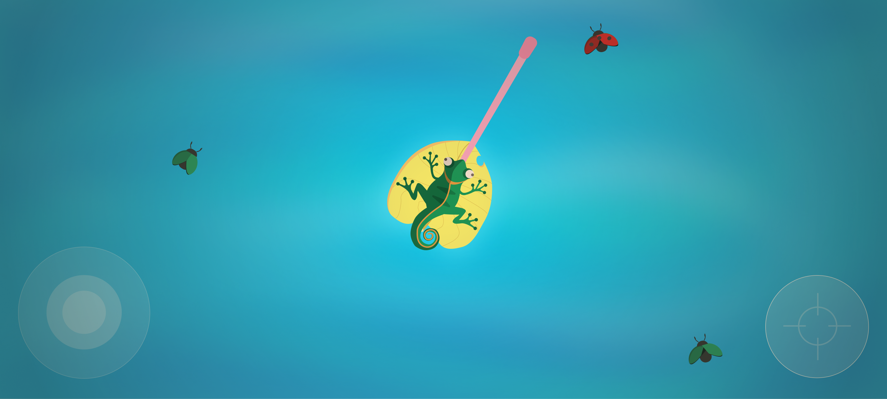

# Tonguemeleon

 <a href="#about">About</a> •
 <a href="#features">Features</a> • 
 <a href="#tecnologias">Tecnologias</a> • 
 <a href="#contribuicao">Contribuição</a> • 
 <a href="#license">License</a> • 
 <a href="#autor">Autor</a>

### About
Tonguemeleon is a mobile casual game about a chameleon trying to eat some bugs.

<h4 align="center"> 
	🚧  Tonguemeleon 🚀 Development in progress...  🚧
</h4>

### Setup

# Clone Tonguemeleon Repository
$ git clone <https://github.com/diegoptenorio/tonguemeleon.git>

# Open GDevelop online editor
<https://editor.gdevelop-app.com/>

# Run game.json 

### Features

- [x] Digital Storm Intro
- [x] Main Menu
- [x] Gameplay
- [x] Exit
- [x] Game Over
- [ ] About
- [ ] New Personal Record

<h1 align="center">
  
</h1>

### 🛠 Tech

Programning Languages and Tools:

- [Javascript](https://developer.mozilla.org/pt-BR/docs/Web/JavaScript)
- [Figma](https://www.figma.com)
- [GDevelop](https://gdevelop-app.com)
- [FreeSound](https://freesound.org)

### Autor
---

<a href="https://www.linkedin.com/in/diegotenorio">
 
  
 <b>Diego Tenório</b></a>

Development and Design: Diego Tenório

### Sound Effects Credits

All sounds are provided by freesound.org plataform

# Background sound:
Countryside with bees by bassboybg
<https://freesound.org/people/bassboybg/sounds/242151/>

# Tongue Sound:
TongueClick1.wav by acclivity
<https://freesound.org/people/acclivity/sounds/34208/>

# UI Sound:
pop.wav by anagar
<https://freesound.org/people/anagar/sounds/267952/>

# Splash Screen Sound
Freezing Logo.wav by .Gomi
<https://freesound.org/people/.Gomi/sounds/553763/>

# Main Menu Music
Energetic Bigbeat Drum Loop by AlexProst
<https://freesound.org/people/AlexProst/sounds/382251/>

# Countdown
Drumsticks [Dave Weckl Evolution] open wide №3..wav by Theriavirra
<https://freesound.org/people/Theriavirra/sounds/270092/>

# GO!
ready set go by Alivvie
<https://freesound.org/people/Alivvie/sounds/451271/>

# Game Over Sound
Game win.mp3 by elijahdanie
<https://freesound.org/people/elijahdanie/sounds/487436/>

# New Highest Score
Crowd Cheer by FoolBoyMedia
<https://freesound.org/people/FoolBoyMedia/sounds/397434/>

# Jingle_Win_00.wav by LittleRobotSoundFactory
<https://freesound.org/people/LittleRobotSoundFactory/sounds/270402/>