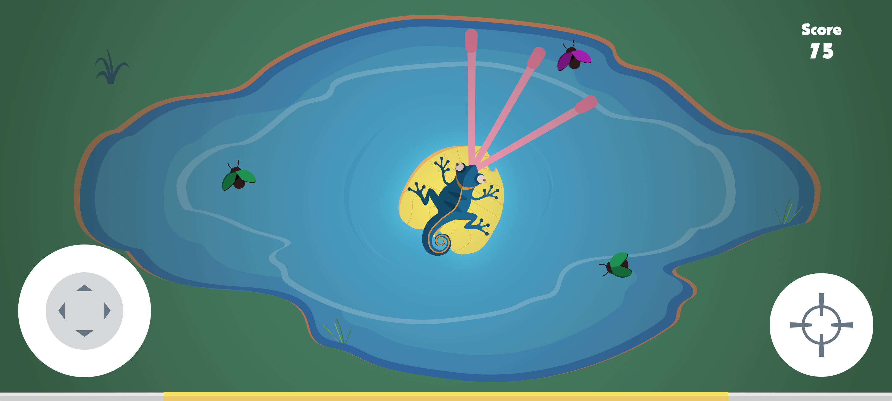

# Tonguemeleon

 <a href="#about">About</a> •
 <a href="#setup">Setup</a> • 
 <a href="#features">Features</a> • 
 <a href="#tech">Tech</a> •
 <a href="#contribution">Contribution</a> • 
 <a href="#author">Author</a> 

# About
Tonguemelon is a casual mobile game about a chameleon trying to eat some insects flying over the lake. Attention because some bugs give special abilities.

# Setup

### Clone Tonguemeleon Repository
$ git clone <https://github.com/diegoptenorio/tonguemeleon.git>

### Install GDevelop
<https://gdevelop-app.com/>

### Run File
game.json 

# Features

- [x] Splash Screen
- [x] Main Menu
- [x] Gameplay
- [x] Exit
- [x] Game Over
- [x] About
- [x] New Personal Record

<h1 align="center">
  
</h1>
<h1 align="center">
  
</h1>
<h1 align="center">
  
</h1>
<h1 align="center">
  
</h1>
<h1 align="center">
  
</h1>
<h1 align="center">
  
</h1>
<h1 align="center">
  
</h1>

# Tech

Tools:

- [Figma](https://www.figma.com)
- [GDevelop](https://gdevelop-app.com)
- [FreeSound](https://freesound.org)
- [mp3cut.net](https://mp3cut.net/)

# Contribution

### Fonts

All fonts are provided by DaFont

- [Nougat-ExtraBlack.ttf](https://www.dafont.com/pt/nougat.font)

### Sound

All sounds are provided by freesound.org

- [Countryside with bees by bassboybg](https://freesound.org/people/bassboybg/sounds/242151/)
- [pop.wav by anagar](https://freesound.org/people/anagar/sounds/267952/)
- [Level Up 01 by rhodesmas](https://freesound.org/people/rhodesmas/sounds/320655/)
- [Energetic Bigbeat Drum Loop by AlexProst](https://freesound.org/people/AlexProst/sounds/382251/)
- [Drumsticks [Dave Weckl Evolution] open wide №3..wav by Theriavirra](https://freesound.org/people/Theriavirra/sounds/270092/)
- [ready set go by Alivvie](https://freesound.org/people/Alivvie/sounds/451271/)
- [Game win.mp3 by elijahdanie](https://freesound.org/people/elijahdanie/sounds/487436/)
- [Crowd Cheer by FoolBoyMedia](https://freesound.org/people/FoolBoyMedia/sounds/397434/)
- [Jingle_Win_00.wav by LittleRobotSoundFactory](https://freesound.org/people/LittleRobotSoundFactory/sounds/270402/)

# Author

<a href="https://www.linkedin.com/in/diegotenorio" target="_blank">
 
  
 <b>Diego Tenório</b></a>

Development and Design

 
